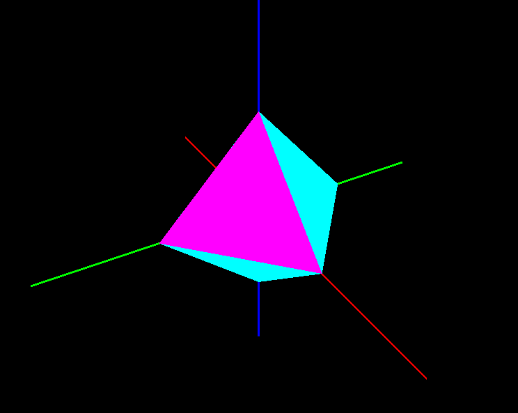
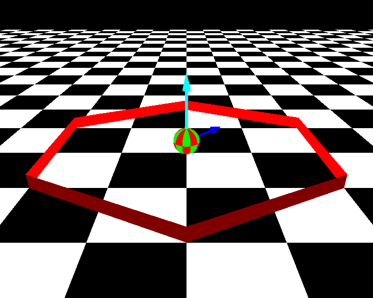
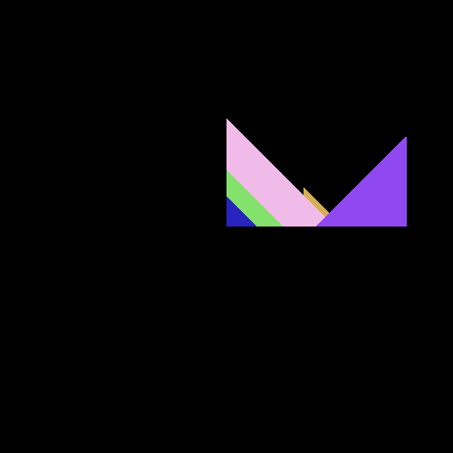
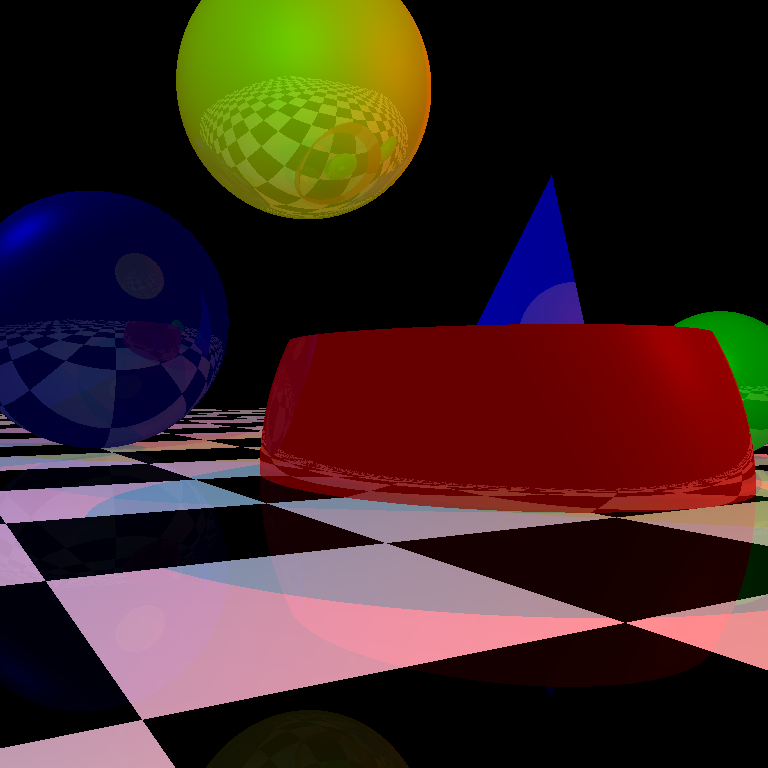
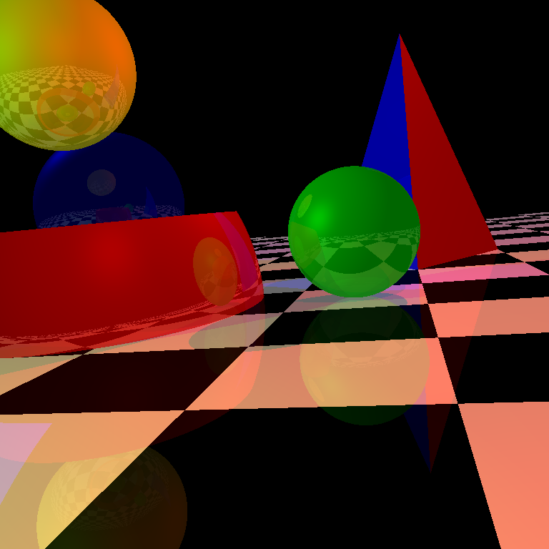
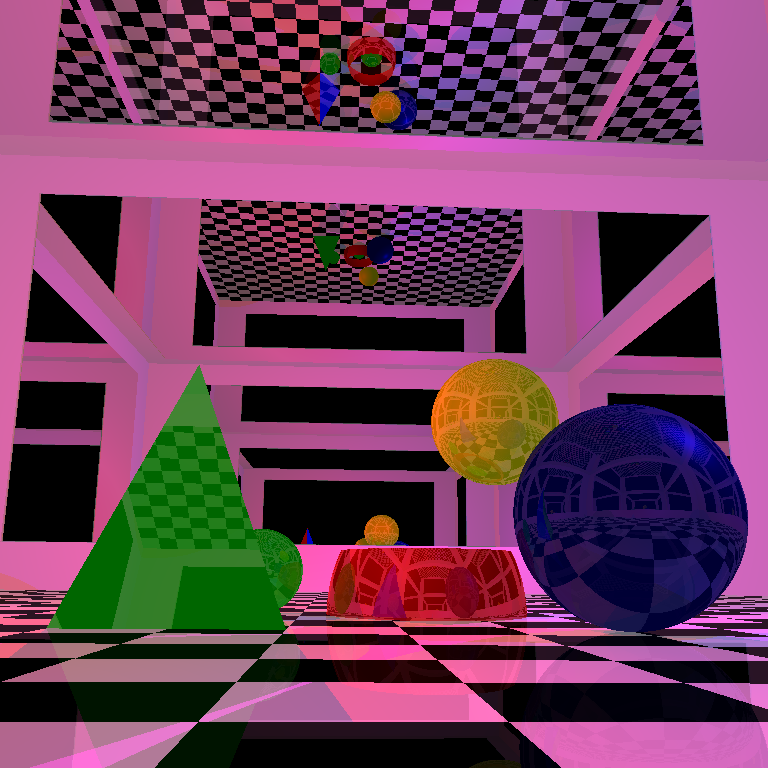
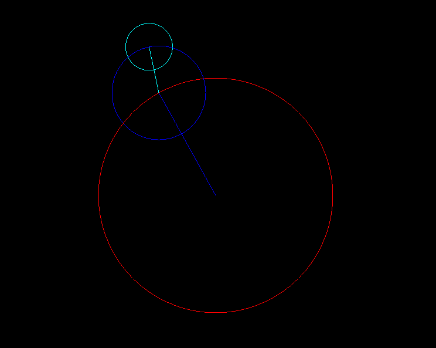

# CSE-410-Computer-Graphics-Sessional

- ## **`Offline 1: OpenGL Basics`**
  Learn the basics of OpenGL 3D functionalities and camera movements and implement two simulations.

    - [Problem Specification](Offline-1-OpenGL/spec/CSE410_opengl.pdf)
    - [Solution](Offline-1-OpenGL/src)

    - Magic Cube
    

    - Rolling Ball
    
    

- ## **`Offline 2: Rasterization Pipeline`**
  Implement a Rasterization Pipeline from scratch as a series of stages including `modeling transformation`, `view transformation`, `projection transformation`, `clipping and scan conversion using Z-buffer algorithm`.

    - [Problem Specification](<Offline-2-Rasterization/Spec/Offline 2 Specifications.pdf>)
    - [Solution](Offline-2-Rasterization/src)

    
    

- ## **`Offline 3: Ray Tracing`**
    Generate realistic images for a few geometric shapes using ray tracing.

    - [Problem Specification](<Offline-3-Ray-Tracing/spec/CSE 410 Offline 3 Specs.pdf>)
    - [Solution](Offline-3-Ray-Tracing/src)

    
    
    

- ## **`Online 1: OpenGL`**
     